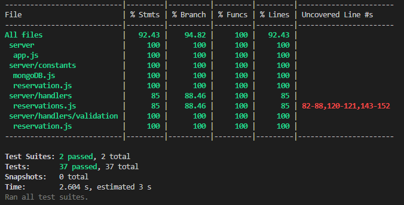

# Panoramic_Hotel
This is a back-end service for Panoramic Hotels.

Panoramic Hotels is now accepting bookings for its presidential suite.

Up to 3 people can stay at once in the presidential suite.

Bookings can only be for up to 3 days.

## Technologies used
---
This backend-service is built with: Node.js, Express.js, MongoDb.

Testing is done with: jest, mongodb-memory-server, supertest.

## Getting started:
---

### Install dependencies

Navigate to `/server` and run
```
yarn install
```

### Connecting MongoDb

MongoDb is used as a database in this back-end service.
For the purpose of this project I used MongoDB's cloud atlas.

To run the app, you must add a connection string in an .env file under `/server`.

You can rename the provide `.env_example` file to `.env` and add your connection string after the `MONGO_URI=` and save.

### Start the application and other details

To start the application use the following command

```
yarn start
```


### Endpoints
|HTTP request | URL |
|-------------|-----|
|GET |"/reservation/:reservationId" |
|POST |"/reservation" |
|DELETE | "/reservation/:reservationId" |

The POST request needs the following body format:
```
body: {
    "email": "henry@ymail.com",
    "firstName": "Henry",
    "lastName": "Smith",
    "numberOfPeople": 1,
    "checkInDate": "2022-11-06",
    "checkOutDate": "2022-11-07"
}
```

### Testing

To run unit testing, use the following command

```
yarn test
```

With coverage

```
yarn test:coverage
```

The current testing suite acheives 92% line coverage



Manual end to end testing was also done using postman